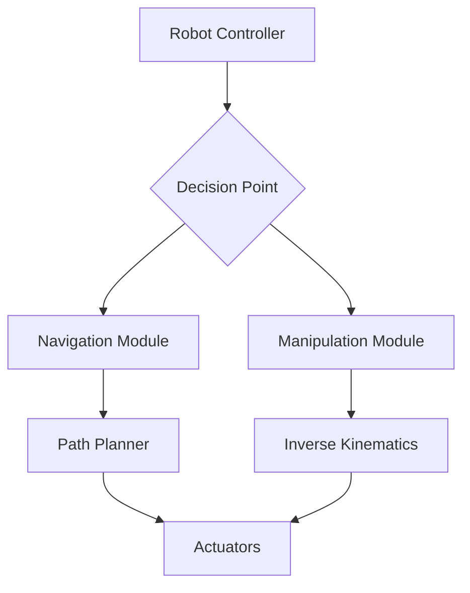

# Architecture Diagram Documentation Guide

## Overview

This guide provides standards and approaches for documenting system architectures in the Physical AI & Humanoid Robotics book. Architecture diagrams help visualize complex systems, data flows, and component interactions.

## 1. Text-Based Architecture Representations

For accessibility and version control, we use text-based representations when possible:

### Simple ASCII Diagrams
```
┌─────────────────┐    Publish    ┌─────────────────┐
│   Sensor Node   │ ────────────▶ │   Planner Node  │
│                 │               │                 │
│ • Camera        │               │ • Path Planning │
│ • IMU           │ ◀──────────── │ • Collision     │
└─────────────────┘   Subscribe   └─────────────────┘
```

### Mermaid Diagrams
Docusaurus supports Mermaid diagrams for more complex visualizations:



## 2. Architecture Documentation Standards

### 2.1 Component Identification
- Use consistent naming conventions
- Clearly label inputs, outputs, and interfaces
- Distinguish between hardware and software components
- Indicate data flow directions

### 2.2 Layered Architecture Representation
```
┌─────────────────────────────────┐
│        Application Layer        │
├─────────────────────────────────┤
│        Service Layer            │
├─────────────────────────────────┤
│        Middleware Layer         │
├─────────────────────────────────┤
│        Hardware Abstraction     │
└─────────────────────────────────┘
```

### 2.3 Data Flow Diagrams
```
Input → Processing → Output
  ↓        ↓         ↓
State → Decision → Action
```

## 3. System Architecture Patterns

### 3.1 Perception-Action Loop
```
┌─────────────────┐    ┌─────────────────┐    ┌─────────────────┐
│   Perception    │───▶│   Cognition     │───▶│     Action      │
│   (Sensors)     │    │   (Planning)    │    │   (Actuators)   │
└─────────────────┘    └─────────────────┘    └─────────────────┘
         ▲                                           │
         │                                           │
         └───────────────────────────────────────────┘
                           Feedback
```

### 3.2 Multi-Robot Coordination
```
       Central Coordinator
       ┌─────────────────┐
       │                 │
       └─────────┬───────┘
                 │
       ┌─────────┼─────────┐
       ▼         ▼         ▼
   ┌───────┐ ┌───────┐ ┌───────┐
   │Robot 1│ │Robot 2│ │Robot 3│
   └───────┘ └───────┘ └───────┘
```

## 4. Simulation Architecture
```
┌─────────────────┐    ┌─────────────────┐    ┌─────────────────┐
│   Real Robot    │    │   Simulator     │    │   Controller    │
│                 │    │                 │    │                 │
│ • Physical      │    │ • Physics       │    │ • ROS 2 Nodes   │
│ • Dynamics      │ ◇──│ • Sensors       │ ◇──│ • Planning      │
│ • Sensors       │    │ • Environment   │    │ • Control       │
└─────────────────┘    └─────────────────┘    └─────────────────┘
```

## 5. Best Practices

### 5.1 Clarity and Simplicity
- Use consistent symbols and notation
- Limit the number of components in a single diagram
- Include legends for complex diagrams
- Focus on the most important relationships

### 5.2 Accessibility
- Provide text descriptions for all diagrams
- Use high contrast colors
- Include alternative text for complex diagrams
- Support screen readers with proper markup

### 5.3 Version Control
- Store diagram source code in version control
- Use text-based formats when possible
- Document changes to architectural diagrams
- Maintain backward compatibility when possible

## 6. Tools and Formats

### 6.1 Recommended Tools
- **Mermaid**: For flowcharts, sequence diagrams, and class diagrams
- **PlantUML**: For UML diagrams and more complex visualizations
- **ASCII art**: For simple diagrams that integrate well with text
- **Draw.io**: For complex diagrams (export as SVG for web use)

### 6.2 Integration with Docusaurus
```md
<!-- Using Mermaid in MDX -->


## 7. Example Architecture Documentation

### 7.1 ROS 2 Node Architecture
```
┌─────────────────────────────────────────────────────────────┐
│                    ROS 2 Node                               │
├─────────────────────────────────────────────────────────────┤
│  ┌─────────────┐    ┌─────────────┐    ┌─────────────┐     │
│  │  Publisher  │───▶│   Service   │───▶│   Action    │     │
│  │   Topic A   │    │   Server    │    │   Client    │     │
│  └─────────────┘    └─────────────┘    └─────────────┘     │
│         │                   │                   │          │
│         ▼                   ▼                   ▼          │
│  ┌─────────────┐    ┌─────────────┐    ┌─────────────┐     │
│  │ Subscriber  │◀───│  Service    │◀───│  Action     │     │
│  │   Topic B   │    │   Client    │    │   Server    │     │
│  └─────────────┘    └─────────────┘    └─────────────┘     │
└─────────────────────────────────────────────────────────────┘
```

## 8. Validation Checklist

Before finalizing architecture diagrams, verify:
- [ ] All components are clearly labeled
- [ ] Data flows are properly indicated
- [ ] Interfaces are documented
- [ ] Legend is provided for complex diagrams
- [ ] Text description is available
- [ ] Diagram is relevant to learning objectives

This guide should be referenced when creating architecture diagrams for any chapter in the book.